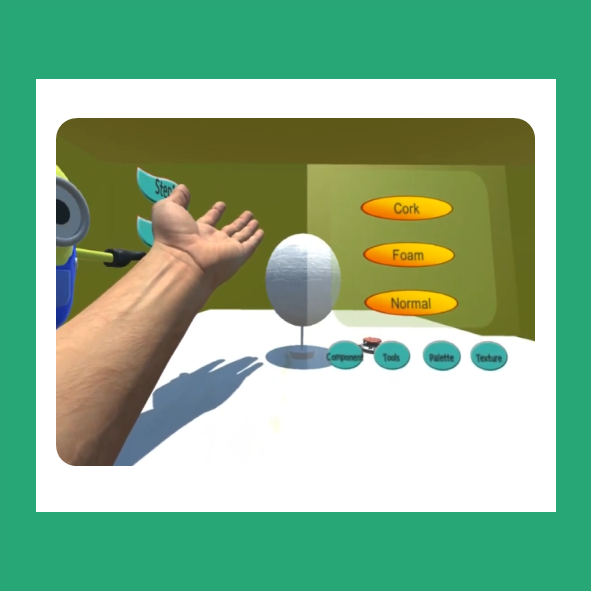

# Virtual Figure Model Crafting with HUD

*"VR 클레이 팹랩에 필요한 사용자 친화적 인터페이스"*

한국연구재단의 지원을 받아 진행한 프로젝트입니다.

**Virtual Figure Model Crafting (VFMC)**은 가상 클레이 체험 콘텐츠로, Oculus DK2와 Leap Motion을 바탕으로 구현되었습니다.

사용자의 Virtual Hand가 Clay에 Force를 가할 때, 그 수치에 따라 Mesh 구조의 변형 알고리즘을 조정하도록 하였습니다. 우리는 VFMC를 바탕으로, 사용자 친화적인 VR HUD Interface를 제안하고자 하였습니다.

Leap Motion의 Hand Gesture를 이용하여, Pop-up Interface를 구현하였습니다. 뿐만 아니라, 사용자와 Interaction하는 동안의 정보를 이전 Interaction 정보와 규합하여, 사용자에게 최적의 Interaction을 환원하는 User Optimization 알고리즘을 구현하였습니다.

대조 방법과 비교한 결과, 제안한 방법이 콘텐츠 체험 시간도 축소시킬 뿐만 아니라, 피로도도 줄일 수 있다는 것을 확인하였습니다.

## Publish
- Conference short paper : [VRST 2018](https://dl.acm.org/doi/abs/10.1145/3281505.3283388)
- Journal : [JIST](https://library.imaging.org/jist/articles/65/2/jist0849)
